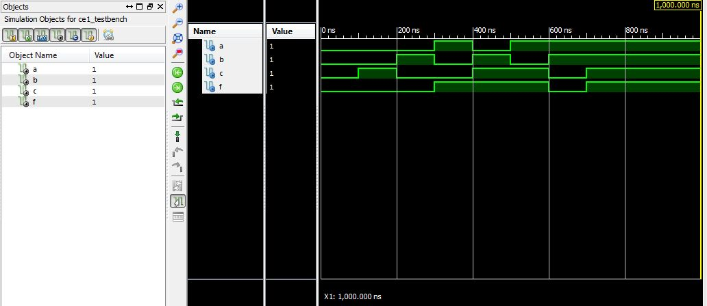

ECE281_CE1
==========

## Predicted Truth Table

A|B|C|F
---|---|---|---
0|0|0|0
0|0|1|0
0|1|0|0
1|0|0|1
0|1|1|1
1|1|0|0
1|1|1|1

## Simulated Waveform
Simulated Waveform: 

##Analysis

The simulated waveform directly copies the predicted truth table if read from earliest time to latest
